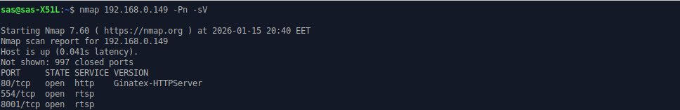

# cloudcam-security-analysis
A security analysis of a manufacturer's Wi-Fi IP camera revealed an unauthenticated RTSP protocol and a default ONVIF configuration.

# OEM IP Camera Security Analysis
## Executive Summary
During a security assessment of a low-cost OEM Wi-Fi IP camera (“Cloud Cam”), security issues were identified.
The device exposes an unauthenticated RTSP stream on the local network, allowing any client to access live video without credentials.
Additionally, the ONVIF service is protected only by default credentials (admin:admin), which are accepted without enforcement of password change.

Using the ONVIF Media Service, it was possible to enumerate media profiles and retrieve a permanent RTSP URI that is not bound to a session, authentication, or timeout.
As a result, an attacker with network access can continuously monitor the camera feed without using the official mobile application.
These issues are common in OEM/ODM devices and may affect multiple rebranded products using the same firmware and hardware platform.

## Device Information
- Device type: OEM Wi-Fi IP Camera
- App name: Cloud Cam
- Firmware: 57.0.0.0629
- Services: RTSP, ONVIF, HTTP

## Attack Surface Discovery
After determining the camera's IP address on the local network, a basic port scan was performed using Available Network Services.

This revealed the following open ports:

- **554/tcp** — RTSP

- **8001/tcp** — service that adds RTSP-like connections (nmap installed as `vcom-tunnel`)

- **80/tcp** — HTTP server

The presence of an RTSP port is expected for an IP camera, but an active HTTP service was unexpected, as the camera was configured exclusively through the mobile app. There is no full-featured web interface for the user, as will be shown below.

Of particular interest was the fact that the RTSP service was available on two ports simultaneously, resulting in multiple streams (primary and secondary) or alternative RTSP endpoints.

## Initial RTSP check

For the initial RTSP check, an attempt was made to connect to the service without specifying a specific resource.

`vlc rtsp://192.168.0.149`

VLC did not return an explicit error, but the video stream did not play. For a lower-level check, an RTSP `DESCRIBE` request was sent directly:

`printf "DESCRIBE rtsp://192.168.0.149:554/ RTSP/1.0\r\nCSeq: 1\r\n\r\n" | nc 192.168.0.149 554`

The server returned a response:

`RTSP/1.0 551 Invalid Method`

This response indicates that the RTSP server received the request, but **does not support the `DESCRIBE` method in this form** (either it expects a preliminary `OPTIONS`, authentication, or a valid media path). Although `DESCRIBE` is a standard RTSP method, many embedded RTSP implementations on IoT devices support only a limited set of methods and do not accept requests to the root URI (`/`).

## Accessing the video stream without authentication

After this, a test was performed using `ffmpeg`:

`ffmpeg -rtsp_transport tcp -i rtsp://192.168.0.149:554/ -t 10 -f null -`

The command successfully started receiving the video stream, indicating that there is no authentication check at the RTSP server level for the default stream.** This means that any client on the local network can access the video stream without knowing the credentials.

`ffplay` was used for verification:

`ffplay -rtsp_transport tcp -i rtsp://192.168.0.149:554/`

This resulted in a live camera stream, without specifying the stream profile path and without authentication.

## HTTP and ONVIF Analysis

Next, the HTTP service on port 80 was examined:

`curl -v http://192.168.0.149/`

The server returns an HTTP redirect (302) to `/index.asp`. However, when attempting to access this path through a browser, the connection is reset. Despite the presence of an HTTP service, there is no full-fledged web interface for the user.

Next, the ONVIF endpoint was checked:

`curl -v http://192.168.0.149/onvif`

The server returned a response with the code `401 Unauthorized` and the header:

`WWW-Authenticate: Basic realm="Onvif"`

This indicates the presence of basic HTTP authentication. ONVIF uses SOAP requests, so a SOAP request was then generated to obtain the video stream URI.

## ONVIF Authentication and Obtaining Media Profiles

The default `admin:admin` credentials were used for verification.

The `GetStreamUri` SOAP request with a non-existent `ProfileToken` returned the `NoProfile` error, indicating:

- ONVIF service is functioning correctly

- authentication successful

- endpoint selected correctly

Using the default `admin:admin` credentials without forcing a password change is a common security issue in OEM devices and significantly reduces the camera's security.

To obtain the correct profiles, a `GetProfiles` request was executed, which found two Media Profiles:

|   Name   |   Token   |      Purpose          |
|----------|-----------|-----------------------|
|mainStream|`Profile_1`|main stream (1920×1080)|
|subStream |`Profile_2`|substream (640×360)    |

After substituting the correct `ProfileToken` into the `GetStreamUri` request, the camera returned a valid RTSP URI:

`rtsp://192.168.0.149:554/0/av0`

## Analyzing the received RTSP URI

The received RTSP URI has the following properties:

- the URI does not contain a login or password

- `InvalidAfterConnect = false`

- `InvalidAfterReboot = false`

- `Timeout = PT0S` (indefinite)

This means that:

- the URI is persistent

- the stream is not session-specific

- authentication is outside of RTSP or is missing entirely

Control check:

`ffplay rtsp://192.168.0.149:554/0/av0`

The connection was successful, the video stream is available in real time.

## Vulnerability Details

### Impact
- Unauthorized access to live video streams from the local network.
- Persistent RTSP URIs allow continuous monitoring without authentication.
- Default ONVIF credentials significantly lower the barrier to full device compromise.
- The vulnerability affects privacy and may expose audio/video surveillance data.

### Root Cause
- The RTSP service does not enforce authentication for the default media stream.
- ONVIF service accepts factory default credentials (`admin:admin`) without requiring a password change.
- The firmware exposes permanent RTSP URIs that are not bound to a session, user, or timeout.
- The device firmware provides **no user-accessible mechanism** to configure RTSP, secure ONVIF, or change authentication behavior.

### Mitigation
Due to the closed nature of the firmware and the absence of official configuration options, **the end user cannot fully mitigate these issues at the device level**.

Possible partial mitigations include:

- Isolating the camera in a separate VLAN or guest network.
- Blocking RTSP (554/tcp, 8001/tcp) and HTTP (80/tcp) access using firewall rules.
- Restricting camera access to the mobile application’s backend only.
- Avoiding exposure of the device beyond the local network.

**Note:** A proper fix requires a firmware update from the manufacturer, enforcing authentication and secure defaults. In practice, such updates are often unavailable for low-cost OEM devices, leaving users permanently exposed.

## Conclusion

The research revealed the following:

- The camera's RTSP stream is accessible without authentication by default.

- The ONVIF service is protected only by the default admin:admin credentials.

- The RTSP URI is persistent and not tied to a session or authorization.

Taken together, this allows access to the camera's video stream without using the official mobile app or entering user credentials.
